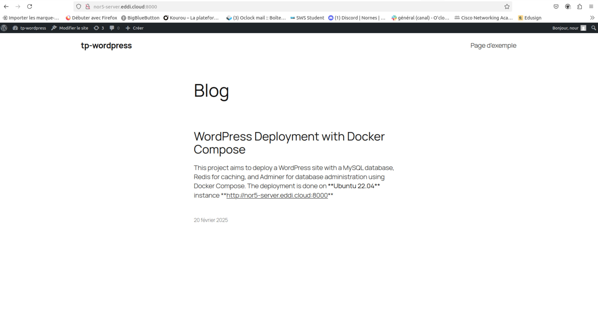
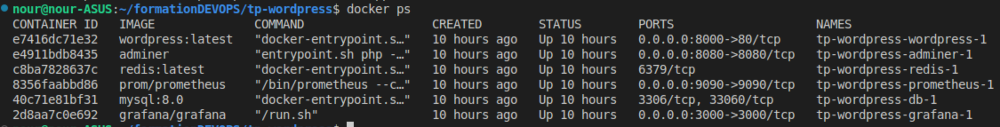

# WordPress Deployment with Docker Compose

## Description

This project aims to deploy a WordPress site with a MySQL database, Redis for caching, and Adminer for database administration using Docker Compose. The deployment is done:
- Locally on **Ubuntu 22.04** with:
    - **Docker version:** 23.0.4
    - **Docker Compose version:** v2.29.2-desktop.2 
- ON an AWS VM instance running **Ubuntu 22.04** with:
    - **Docker version:** 27.5.1
    - **Docker Compose version:** v2.32.4 

**Note** The AWS VM instance does not run indefinitely; it shuts down after 8 hours of operation. You may not be able to access the provided link if the instance is not running.
## Installation & Setup

1. Navigate to the project directory:
`cd tp-wordpress`
2. Start the services in detached mode:
 `docker compose up -d`
3. Check running containers:
`docker ps`

## Access the services
| Service   | URL                          |  Description                                                                                |
|-----------|------------------------------|---------------------------------------------------------------------------------------------|
| WordPress | http://127.0.0.1:8000        | Access the WordPress website. Use credentials from the .env file to log in as admin or user.|
| Adminer   | http://127.0.0.1:8080        | Database management interface. Credentials are stored in .env.                              |
| Prometheus| http://127.0.0.1:9090/targets| Monitoring interface to check available metrics.                                    |
| Grafana   | http://127.0.0.1:3000        | Visualization and dashboard management. Default admin credentials: admin/admin.             |

**Note** You can access services on  [AWS VM](http://nor5-server.eddi.cloud:8000/) using http://nor5-server.eddi.cloud:port, replacing port with the appropriate service port.

## Troubleshooting

1. Check the logs of a specific container :
` docker logs <conainer_name>`

## Choices of configuration

### Adminer over phpMyAdmin:
I choose Adminer because it is a lighter alternative to phpMyAdmin and supports multiple types of databases (MySQL, PostgreSQL, SQLite, etc.) in a single interface, and  also provides a better, friendlier user interface.

### Environment Variables:

- *WORDPRESS_DB_HOST*, *WORDPRESS_DB_USER*, *WORDPRESS_DB_PASSWORD*, *WORDPRESS_DB_NAME* are configured in the .env file to allow WordPress to connect to the MySQL database.
- *MYSQL_DATABASE*, *MYSQL_USER*, *MYSQL_PASSWORD*, *MYSQL_RANDOM_ROOT_PASSWORD* are also defined in .env to configure MySQL.
- *ADMINER_DEFAULT_SERVER* and *ADMINER_DESIGN* are used to configure Adminer to use mySQl db server and a theme.

### Network:

All services are connected to the Docker network **wp-network** to ensure communication between them. This guarantees that WordPress, MySQL, Redis, Adminer, Prometheus, and Grafana can communicate with each other on this network.

### Volumes:

- wp-content: The volume *./wp-content* is mounted to */var/www/html/wp-content* to persist WordPress content, such as themes and plugins.
- redis-data: The volume *redis-data* is mounted to */data* to persist Redis data.
- data-mysql: The volume *data-mysql* is mounted to */var/lib/mysql* to persist MySQL data.

### Challenges encountred:

 1.  I encountered an issue while trying to install the Redis Cache plugin for WordPress using WP-CLI in my docker-compose file (without connecting to the container and executing the command `wp plugin install redis-cache --activate --allow-root`). WordPress wasn't fully initialized, and I encountered errors when running WP-CLI commands. I used a 10-second sleep to ensure that the WordPress container had finished loading the necessary services before attempting to install and activate the plugin.

2.  Collect Docker metrics with Prometheus problems. Eccroding to the [docker documentation](https://docs.docker.com/engine/daemon/prometheus/) it was necessary to adjust the network configurations in prometheus.yml, and add this line`{"metrics-addr": "127.0.0.1:9323"}` to /etc/docker/daemon.json file to ensure proper access between the containers.

## Future Improvements and perspectives 

- Add health checks for services to ensure smooth operation.
    1. Ensures  the database MySQL (db) is ready before WordPress tries to connect.
    2. Ensures Redis is available before WordPress tries to cache data.

- Implement a centralized logging system.
- Set up Grafana dashboards to visualize WordPress and MySQL performance metrics.
- Deploy to a production server. 
- Schedule automated backups for MySQL DB.
- Secure access to Adminer and avoid exposing it publicly.
- Add an SSL certificate for the WordPress website.
